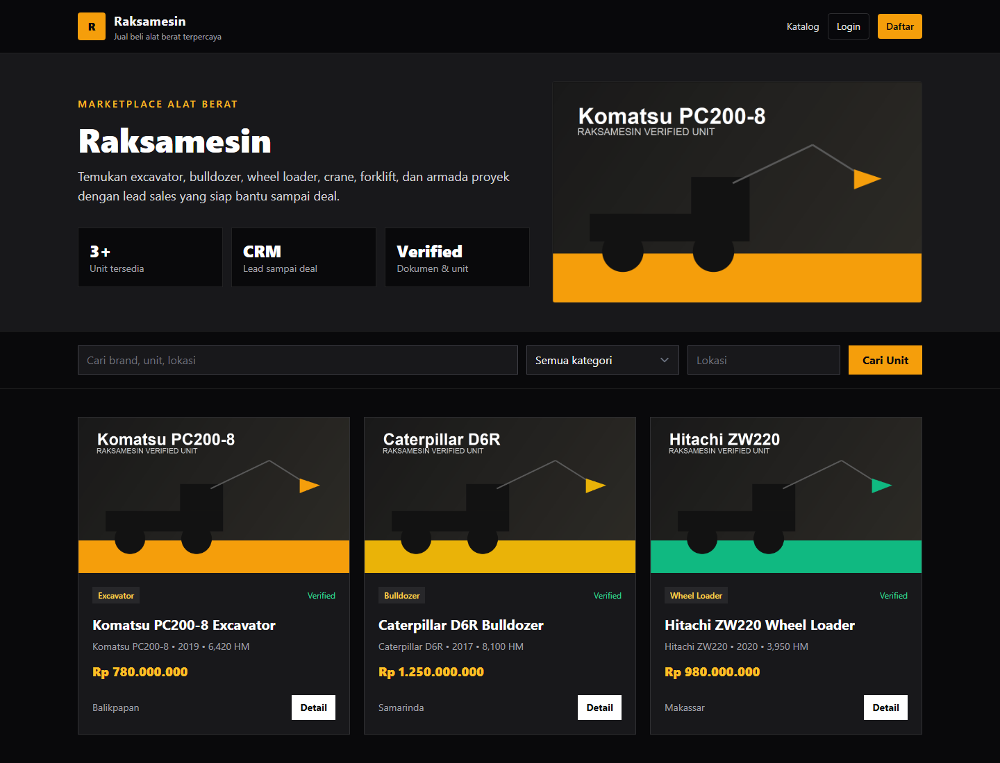
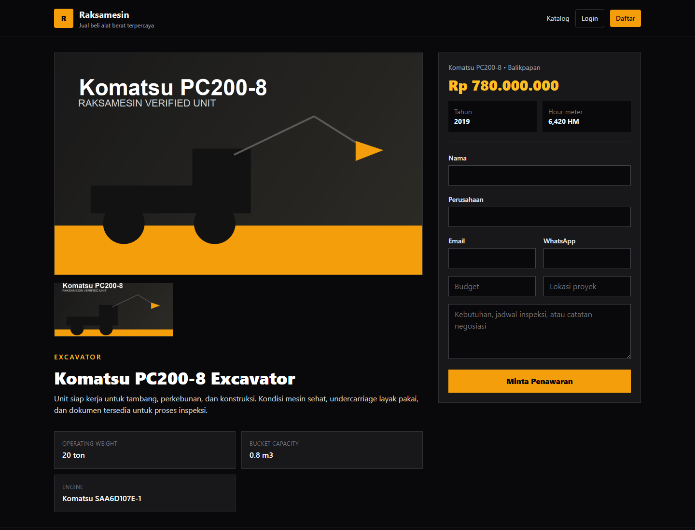

# Raksamesin


**Raksamesin** adalah marketplace alat berat modern untuk menampilkan unit, menerima inquiry pembeli, mengelola lead sales, inspeksi, penawaran, dan proses deal dalam satu sistem.



## Yang Dibangun

- Katalog publik untuk excavator, bulldozer, wheel loader, dan unit proyek lain.
- Halaman detail unit dengan spesifikasi, harga, lokasi, status verified, dan form inquiry.
- Admin panel Filament untuk mengelola kendaraan, lead, inspeksi, dan quotation.
- Pipeline lead dari inquiry sampai follow-up sales.
- Role akses untuk `super_admin`, `admin`, `sales`, `finance`, `seller`, dan `buyer`.
- Auth lengkap: login, register, forgot password, reset password, dan Google OAuth.
- Audit log untuk perubahan penting seperti status lead, harga unit, dan verifikasi unit.

## Preview Detail Unit



## Tech Stack

- **Backend:** Laravel 12
- **Admin Panel:** Filament 4
- **Frontend:** Blade, Tailwind CSS, Alpine.js
- **Database:** SQLite untuk development, siap dipindah ke MySQL/MariaDB
- **Auth:** Laravel Breeze
- **Google Login:** Laravel Socialite
- **Role & Permission:** Spatie Laravel Permission
- **Audit Log:** Spatie Laravel Activitylog

## Setup Lokal

```bash
composer install
npm install
copy .env.example .env
php artisan key:generate
php artisan migrate --seed
php artisan storage:link
npm run build
php artisan serve --host=127.0.0.1 --port=8012
```

Website:

```text
http://127.0.0.1:8012
```

Admin panel:

```text
http://127.0.0.1:8012/admin
```

## Akun Demo

```text
Super Admin: admin@raksamesin.test / password
Sales:       sales@raksamesin.test / password
```

## Google Login

Buat OAuth Client di Google Cloud Console, lalu isi:

```env
GOOGLE_CLIENT_ID=
GOOGLE_CLIENT_SECRET=
GOOGLE_REDIRECT_URI=http://127.0.0.1:8012/auth/google/callback
```

Untuk production, ganti `APP_URL` dan `GOOGLE_REDIRECT_URI` memakai domain asli.

## Deploy Singkat

Di server production:

```bash
composer install --no-dev --optimize-autoloader
npm ci
npm run build
php artisan key:generate
php artisan migrate --force
php artisan storage:link
php artisan optimize
```

Pastikan document root web server diarahkan ke folder `public`.
